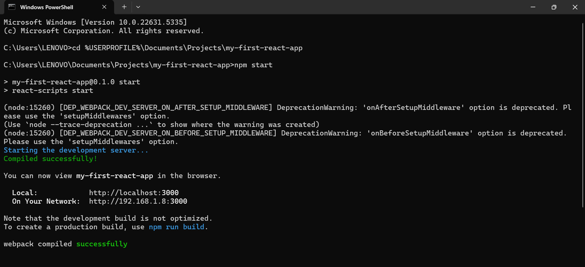
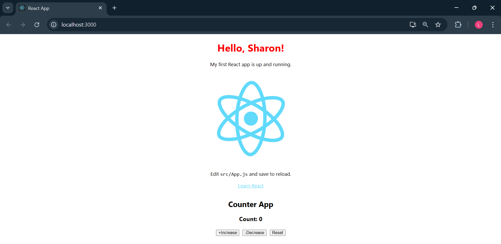

# My First React App

This is a simple React project I built to learn components and hooks.

## Live Demo

- → [https://<your-netlify-url>.netlify.app](https://app.netlify.com/projects/stellular-platypus-5b6d1e/deploys/6855b0aaba9823eb8db12802)
+ → [▶️ View Live Demo](https://stellular-platypus-5b6d1e.netlify.app)

## Screenshots

### 1. App Startup  

### 2. Counter Component  

## How to Run Locally

1. `git clone https://github.com/Norahs-00/my-first-react-app.git`  
2. `cd my-first-react-app`  
3. `npm install`  
4. `npm start`
